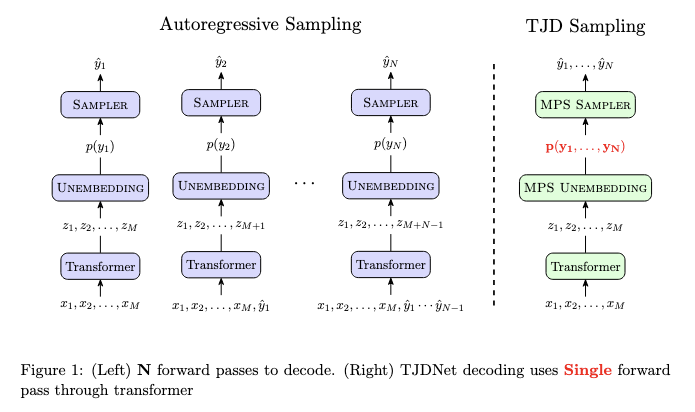

<!-- # TJDNet: Speeding up Language Model Inference via Tensorized Joint Distribution Networks

Speeding up language model inference via tensorized joint distributions. This codebase implements TJDNet for GPT and LLAMA models but can be easily extended to other models. -->

<div align="center">

<h1>TJDNet: Speeding up Language Model Inference via Tensorized Joint Distribution Networks</h1>


<i> Speeding up language model inference via tensorized joint distributions </i>



<!-- <i>Speeding up language model inference via tensorized joint distributions.</i> -->

<!-- <i> (Left) N forward passes to decode. (Right) TJDNet decoding uses Single forward
pass through transformer</i> -->

</div>

## Overivew

This repository provides the implementation for TJDNet, allowing for faster inference with Large Language Models (LLMs) like GPT and LLaMA variants. The core idea is to replace the standard autoregressive sampling head with a tensorized head (e.g., MPS or CP) that predicts the joint distribution of multiple future tokens simultaneously.

While examples focus on GPT and LLaMA, the framework is designed to be extensible to other transformer architectures. Experimental results are presented [here](#Results).


## Installation 
Requires **Python 3.9+**. Using a virtual environment (like venv or conda) is highly recommended.

```bash
# 1. Clone the repository (if you haven't already)
git clone git@github.com:marawangamal/TJDNet.git
cd tjdnet

# 2. Create and activate a virtual environment (optional but recommended)
python -m venv .venv
source .venv/bin/activate  # On Windows use `.venv\Scripts\activate`

# 3. Upgrade pip and install dependencies
pip install --upgrade pip
pip install -r requirements.txt

# 4. Install the TJDNet package itself in editable mode
pip install -e .

# 5. (optional) login to wandb
wandb login

# 6. (optional) login to huggingface -- needed to run llama models
huggingface-cli login
```

### Sanity Check ✅

To verify that your installation and setup are correct train a small model on a toy dataset and confirm it reaches nearly 100% accuracy:

```bash
python main.py fit --model.model gpt2 --model.model_head cp --trainer.max_epochs 8
```

After training for 4 epochs (~5 minutes on a single 40GB GPU), you should observe **100% accuracy** on the stemp dataset and an output like this

```txt
What is -8°C in Fahrenheit?

Let's solve this step by step:
1) To convert Celsius to Fahrenheit, use the formula: °F = (°C x 9/5) + 32
2) Plugging in -8°C:
   °F = (-8 x 9/5) + 32
   °F = 17.6

####
17.6<|endoftext|>
Eval accuracy: 1.0
```


## Training

To fine-tune Llama using the Canonical Polyadic (CP) head, run this command (best checkpoint will be saved under `checkpoints`)
```bash 
python main.py fit --data.dataset sharegpt \
    --model.model lmsys/vicuna-7b-v1.5 
    --model.model_head cp \
    --model.hidden_dim 8192 \
    --model.horizon 2 \
    --model.rank 2 \
    --model.use_memory_efficient_loss
    --trainer.max_epochs 1 \
    --trainer.batch_size 8 
```

## Evaluation
To run evaluation (compute accuracy) run the following command
```bash 
python main.py test --ckpt_path path/to/my/checkpoint --data.dataset gsm8k
```

## Reproducing figures from the paper
Results obtained after training Vicuna 7b on ShareGPT and testing on GSM8k.


<!-- ### Figure 1.

Run `scripts/plots/plot_output_dist_spectrum.py`

Use  to create the hf dataset then run 
```bash
huggingface-cli upload mremila/tjdnet datasets/tjdnet --repo-type dataset
``` -->