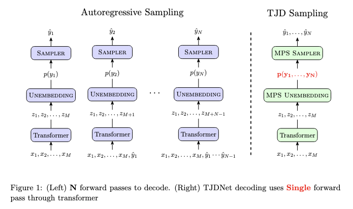

<!-- # TJDNet: Speeding up Language Model Inference via Tensorized Joint Distribution Networks

Speeding up language model inference via tensorized joint distributions. This codebase implements TJDNet for GPT and LLAMA models but can be easily extended to other models. -->

<div align="center">

<h1>TJDNet: Speeding up Language Model Inference via Tensorized Joint Distribution Networks</h1>


<i> Speeding up language model inference via tensorized joint distributions </i>



<!-- <i>Speeding up language model inference via tensorized joint distributions.</i> -->

<!-- <i> (Left) N forward passes to decode. (Right) TJDNet decoding uses Single forward
pass through transformer</i> -->

</div>

## Overivew

This repository provides the implementation for TJDNet, allowing for faster inference with Large Language Models (LLMs) like GPT and LLaMA variants. The core idea is to replace the standard autoregressive sampling head with a tensorized head (e.g., MPS or CP) that predicts the joint distribution of multiple future tokens simultaneously.

While examples focus on GPT and LLaMA, the framework is designed to be extensible to other transformer architectures. Experimental results are presented [here](#Results).


## Installation 
Requires **Python 3.9+**. Using a virtual environment (like venv or conda) is highly recommended.

```bash
# 1. Clone the repository (if you haven't already)
git clone git@github.com:marawangamal/TJDNet.git
cd tjdnet

# 2. Create and activate a virtual environment (optional but recommended)
python -m venv .venv
source .venv/bin/activate  # On Windows use `.venv\Scripts\activate`

# 3. Upgrade pip and install dependencies
pip install --upgrade pip
pip install -r requirements.txt

# 4. Install the TJDNet package itself in editable mode
pip install -e .

# 5. (optional) login to wandb
wandb login
```


## Training

To fine-tune Lllama7b using the Canonical Polyadic (CP) head, run this command (best checkpoint will be saved under `checkpoints`)
```bash 
accelerate launch --use_fsdp --config_file configs/fsdp/fsdp_4gpus.yaml train.py \
    --dataset gsm8k \
    --model_type llama7b \
    --epochs 50 \
    --batch_size 8 \ 
    --seq_len 128 \ 
    --lr 1e-5 \ 
    --model_head cp \ 
    --hidden_dim 5120 \ 
    --horizon 2 \ 
    --horizon_eval 2 \ 
    --rank 16
```

## Evaluation
To run evaluation (compute accuracy) run the following command
```bash 
python scripts/eval_acc.py -c <checkpoint_path>
```

<!-- 
| Model                              | Latency [s]   | GPU Memory (allocated)[MB]   | GPU Memory (reserved) [MB]   | CPU Memory (rss) [MB]   | Accuracy      |
| llama::base::bs::1                 | 2.884 ± 0.003 | 25340.167 ± 0.000            | 25356.000 ± 0.000            | 1213.004 ± 0.015        | 0.000 ± 0.000 |
| llama::cp::rank8::horizon2::bs::1  | 1.520 ± 0.001 | 27165.341 ± 0.000            | 27182.000 ± 0.000            | 1221.140 ± 0.014        | 0.000 ± 0.000 |
| llama::cp::rank16::horizon2::bs::1 | 1.565 ± 0.008 | 28445.653 ± 0.000            | 28462.000 ± 0.000            | 1223.598 ± 0.000        | 0.000 ± 0.000 | 
-->


<!-- OLD Version -->
<!-- | Model                            | Latency [s]   | Accuracy      |
|:---------------------------------|:--------------|:--------------|
| llama::baseline             | 1.441 ± 0.007 | 0.1290 |
| llama::cp::lr32::hd768::rank4::horizon2  | 0.745 ± 0.004 | 0.0492 |
| llama::cp::lr32::hd768::rank8::horizon2  | 0.752 ± 0.002 | 0.0540 |
| llama::cp::lr32::hd768::rank16::horizon2 | 0.767 ± 0.003 | 0.0549 |
| llama::cp::lr32::hd768::rank32::horizon2 | 0.833 ± 0.028 | 0.0584 |
| llama::cp::lr64::hd768::rank8::horizon2  | - | 0.0417 |
| llama::cp::lr32::hd1024::rank8::horizon2 | - | 0.0629 |
| llama::cp::lr32::hd1280::rank8::horizon2 | - | 0.0781 |
| llama::cp::lr32::hd1536::rank8::horizon2 | - | 0.0713 |
| llama::cp::lr32::hd5120::rank8::horizon2 | - | 0.0925** | -->


## Job Runner (SLURM)

Use `scripts/jobrunner.py` to submit and track multiple experiments, particularly on clusters using the SLURM workload manager.

* **Submit a single job:**
    Wrap your full training or evaluation command string in quotes.
    ```bash
    python scripts/jobrunner.py --job "<your_full_command_here>"
    ```

* **Submit batch jobs from a config file:**
    Define parameters for multiple jobs in a YAML file (see `config/train.yaml` for format).
    ```bash
    python scripts/jobrunner.py -f config/train.yaml
    ```

* **Check status of submitted jobs:**
    ```bash
    python scripts/jobrunner.py -s
    ```

*(Note: This job runner currently assumes a SLURM environment (`sbatch`, `squeue` commands).)*


## Results
Results obtained after training LLama7b on GSM8k for 50 epochs are given

| Model                                      | Latency [s]   | Accuracy |  
|:-------------------------------------------|:--------------|:---------|
| llama::base::bs::1                         | 2.884 ± 0.003 | 0.1290   |
| llama::cp::rank8::hd1024::horizon2::bs::1  |               | train*   |
| llama::cp::rank8::hd1280::horizon2::bs::1  |               | train*   |
| llama::cp::rank8::hd2048::horizon2::bs::1  |               | 0.0902   |
| llama::cp::rank8::hd4096::horizon2::bs::1  |               | 0.0842   |
| llama::cp::rank8::hd5120::horizon2::bs::1  | 1.520 ± 0.001 | 0.0925   |
| llama::cp::rank16::hd5120::horizon2::bs::1 | 1.565 ± 0.008 | train*   |
| llama::cp::rank32::hd5120::horizon2::bs::1 | 1.565 ± 0.008 | eval*    |
| llama::cp::rank8::hd8192::horizon2::bs::1  |               | 0.0773   |


<!-- | Model                            | Latency [s]   | Accuracy      |
|:---------------------------------|:--------------|:--------------|
| llama::base::bs::1               | 1.441 ± 0.007 | 0.1290 |
| llama::cp::nl2::rank4::horizon2  | 0.745 ± 0.004 | 0.0492 |
| llama::cp::nl2::rank8::horizon2  | 0.752 ± 0.002 | 0.0540 |
| llama::cp::nl2::rank16::horizon2 | 0.767 ± 0.003 | 0.0549 |
| llama::cp::nl2::rank32::horizon2 | 0.833 ± 0.028 | - |
| llama::ucp::nl2::rank4::horizon2  | - | - |
| llama::ucp::nl2::rank8::horizon2  | - | - |
| llama::ucp::nl2::rank16::horizon2 | - | - |
| llama::ucp::nl2::rank32::horizon2 | - | - | -->


<!-- 
## Evaluation
To evaluate on HumanEval, run the following commands

1. Generate completetions (will be saved to samples.jsonl)
    ```
    python eval/generate_completions.py --ckpt checkpoints/<checkpoint directory name>
    ```
2. Evaluate completetions
    ```
    python eval/human-eval/human_eval/evaluate_functional_correctness.py samples.jsonl
    ```

## Visualization
1. Generate completetions (will be saved to samples.jsonl)
    ```
    python eval/generate_completions.py --dev --ckpt checkpoints/<checkpoint directory name>
    ```

2. Visualize a code completion sample
    ```
    python eval/visualize.py samples.jsonl
    ``` -->